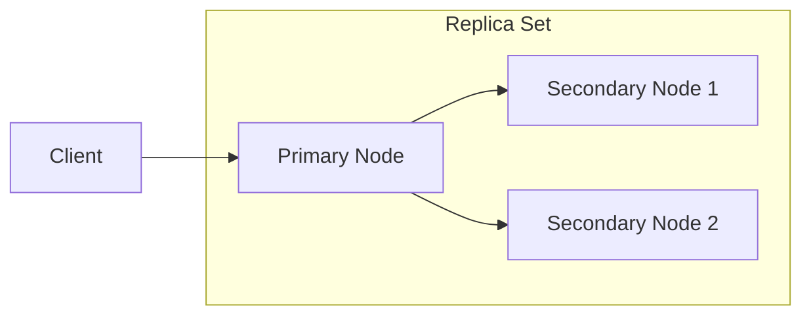
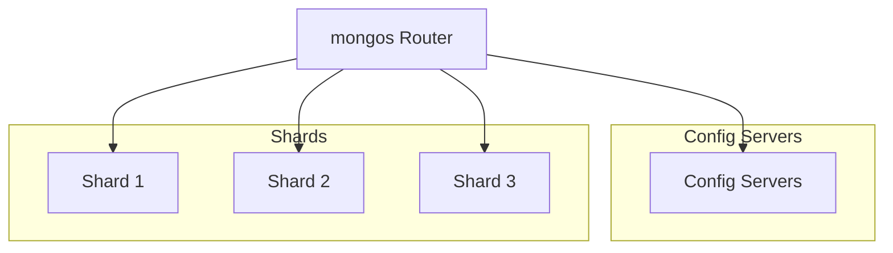

# MongoDB MDB300 Learning Notes

## Module 1: Replication Part 1

### Understanding MongoDB Replication

MongoDB achieves high availability (HA) through replica sets, which are groups of MongoDB instances that maintain the same data set.

#### Replica Set Architecture



#### Key Components:

1. **Primary Node**:
   - Handles all write operations
   - Can handle read operations
   - Maintains operation log (oplog)
   - Only one primary at a time

2. **Secondary Nodes**:
   - Maintain copy of primary's data
   - Can handle read operations (if configured)
   - Continuously sync from primary
   - Can become primary through election

3. **Oplog (Operations Log)**:
   - Capped collection in `local` database
   - Records all data modifications
   - Used for replication
   - Default size is 5% of free disk space

### Replication Process

#### Write Operations Flow:

1. Client sends write operation to primary
2. Primary applies write to its data set
3. Primary records operation in oplog
4. Secondary nodes continuously tail the oplog
5. Secondaries apply operations asynchronously

```javascript
// Example: Check replica set status
db.adminCommand({ "replSetGetStatus": 1 })

// Example: Check oplog size and usage
db.printReplicationInfo()
```

### Replica Set Configuration

#### Basic Setup

```javascript
// Initiate a replica set
rs.initiate({
  _id: "myReplicaSet",
  members: [
    { _id: 0, host: "mongodb0.example.net:27017" },
    { _id: 1, host: "mongodb1.example.net:27017" },
    { _id: 2, host: "mongodb2.example.net:27017" }
  ]
})

// Add a member to replica set
rs.add("mongodb3.example.net:27017")

// Remove a member
rs.remove("mongodb2.example.net:27017")
```

#### Member Configuration Options

| Option | Description | Example Value |
|--------|-------------|---------------|
| `priority` | Election priority (0-1000) | `1` |
| `hidden` | Hidden from applications | `true/false` |
| `votes` | Voting rights in elections | `1` or `0` |
| `slaveDelay` | Replication delay in seconds | `3600` |
| `buildIndexes` | Build indexes on this member | `true/false` |

## Module 2: Replication Part 2

### Replica Set Elections

Elections occur when:
- Primary becomes unavailable
- Maintenance operations
- Adding/Removing members
- Network partitions

#### Election Process:

1. Detection of primary unavailability
2. Election timeout triggers
3. Eligible members call for election
4. Voting process
5. New primary assumes role

#### Election Factors:

- Member priority
- Oplog position (replication lag)
- Connectivity to majority
- Server ID (as tiebreaker)

### Read and Write Concerns

#### Write Concerns

```javascript
// Write with majority confirmation
db.collection.insertOne(
  { item: "example" },
  { writeConcern: { w: "majority", wtimeout: 5000 } }
)
```

| Write Concern | Description |
|---------------|-------------|
| `w: 1` | Primary only |
| `w: 2` | Primary + one secondary |
| `w: "majority"` | Majority of voting members |
| `j: true` | Wait for journal write |

#### Read Concerns

```javascript
// Read with majority confirmation
db.collection.find().readConcern("majority")
```

| Read Concern | Description |
|--------------|-------------|
| `local` | No guarantee of durability |
| `available` | No guarantee of consistency |
| `majority` | Returns majority-committed data |
| `linearizable` | Strong consistency |

### Monitoring Replication

#### Key Metrics to Monitor:

1. **Replication Lag**:
   ```javascript
   // Check replication lag
   rs.printSlaveReplicationInfo()
   ```

2. **Oplog Window**:
   - Time range of operations in oplog
   - Critical for recovery and maintenance

3. **Member State**:
   - PRIMARY
   - SECONDARY
   - STARTUP
   - RECOVERING
   - ROLLBACK

4. **Heartbeat Status**:
   - Member connectivity
   - Network latency

## Module 3: Sharding Part 1

### Understanding Sharding

Sharding is MongoDB's approach to horizontal scaling, distributing data across multiple machines.

#### Sharded Cluster Components:



1. **mongos**: 
   - Query router
   - Client connection point
   - Caches cluster metadata

2. **Config Servers**:
   - Store cluster metadata
   - Run as replica set
   - Maintain chunk distribution

3. **Shards**:
   - Store data portions
   - Run as replica sets
   - Handle data operations

### Shard Keys

The shard key determines how data is distributed across shards.

#### Shard Key Properties:

1. **Cardinality**: Number of unique values
2. **Frequency**: Distribution of values
3. **Monotonic Change**: Rate of increase/decrease

#### Choosing Shard Keys:

```javascript
// Enable sharding for database
sh.enableSharding("mydb")

// Shard a collection
sh.shardCollection(
  "mydb.users",
  { "userId": "hashed" }  // Hashed shard key
)
```

Best Practices:
- High cardinality
- Low frequency
- Non-monotonic
- Supports common queries

## Module 4: Sharding Part 2

### Chunk Management

Chunks are contiguous ranges of sharded data.

#### Chunk Operations:

```javascript
// Check chunk distribution
sh.status()

// Move a chunk manually
sh.moveChunk(
  "mydb.users",
  { userId: "12345" },
  "shard2"
)
```

#### Balancer Configuration:

```javascript
// Check balancer status
sh.getBalancerState()

// Set balancer window
sh.setBalancerState(true)
db.settings.update(
  { _id: "balancer" },
  { $set: { activeWindow: { start: "23:00", stop: "6:00" } } }
)
```

### Sharding Strategies

1. **Ranged Sharding**:
   - Based on shard key ranges
   - Good for range-based queries
   - Risk of hotspots

2. **Hashed Sharding**:
   - Even distribution
   - Random access pattern
   - No range-based queries

3. **Zoned Sharding**:
   - Data locality
   - Custom placement rules
   - Geographic distribution

```javascript
// Create zone
sh.addShardToZone("shard1", "us-east")

// Add zone range
sh.updateZoneKeyRange(
  "mydb.users",
  { "location": "NY" },
  { "location": "PA" },
  "us-east"
)
```

### Query Routing

#### Query Types:

1. **Targeted Queries**:
   - Use shard key
   - Route to specific shard
   - Most efficient

2. **Broadcast Queries**:
   - No shard key
   - Query all shards
   - Less efficient

```javascript
// Targeted query (efficient)
db.users.find({ userId: "12345" })

// Broadcast query (less efficient)
db.users.find({ name: "John" })
```

## Module 5: Basic Backup Options

### Backup Strategies

#### 1. Logical Backups (mongodump)

```bash
# Full database backup
mongodump --uri="mongodb://localhost:27017" --out=/backup/full

# Single collection backup
mongodump --uri="mongodb://localhost:27017" \
  --db=mydb --collection=users \
  --out=/backup/users
```

Pros:
- Human-readable
- Selective backup
- Platform-independent

Cons:
- Slower than physical backup
- Larger backup size
- Resource intensive

#### 2. Physical Backups (mongodump)

```bash
# Stop MongoDB service
systemctl stop mongod

# Copy data files
cp -r /var/lib/mongodb/* /backup/files/

# Restart MongoDB service
systemctl start mongod
```

Pros:
- Faster than logical backup
- Smaller backup size
- Block-level backup support

Cons:
- Platform dependent
- Requires downtime (without LVM)
- All-or-nothing approach

### Backup Best Practices

1. **Regular Schedule**:
   - Daily full backups
   - Hourly incremental backups
   - Retention policy enforcement

2. **Testing**:
   - Regular restore testing
   - Validation of backup integrity
   - Recovery time objectives (RTO)

3. **Security**:
   - Encrypted backups
   - Secure transfer
   - Access control

4. **Monitoring**:
   - Backup success/failure
   - Backup size trends
   - Restore testing results

### Point-in-Time Recovery

```javascript
// Enable oplog for point-in-time recovery
mongod --replSet "rs0" --oplogSize 10240

// Backup with oplog
mongodump --uri="mongodb://localhost:27017" \
  --out=/backup/full \
  --oplog

// Restore to specific point
mongorestore --oplogReplay \
  --oplogLimit "1634947200" \
  /backup/full
```

#### Recovery Process:

1. Restore full backup
2. Apply oplog entries
3. Validate data consistency
4. Switch to restored database

### Atlas Backup Solutions

MongoDB Atlas provides automated backup solutions:

1. **Continuous Backup**:
   - Point-in-time recovery
   - Queryable backups
   - Cross-region copies

2. **Cloud Provider Snapshots**:
   - EBS snapshots (AWS)
   - Azure Disk Snapshots
   - Google Cloud Snapshots

3. **Export/Import**:
   - MongoDB Tools support
   - Custom retention policies
   - Scheduled exports

## Summary

MDB300 covers advanced MongoDB operations:

1. **Replication**:
   - High availability through replica sets
   - Automatic failover
   - Read/write concerns

2. **Sharding**:
   - Horizontal scaling
   - Data distribution strategies
   - Chunk management

3. **Backup**:
   - Multiple backup methods
   - Point-in-time recovery
   - Best practices

Key takeaways:
- Design for scalability from the start
- Monitor replication health
- Choose appropriate shard keys
- Implement comprehensive backup strategy 